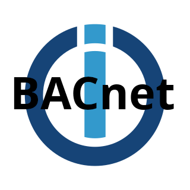

# ioBroker.bacnet

**Tests:** 

## bacnet adapter for ioBroker

Adapter to communicate with devices using BACnet

## Setup Adapter Config

### General Settings

#### Poll interval
The poll interval in seconds.  
If set to 0, there will be no polling, except when the adapter starts.  
Changes can also be received through subscriptions

#### Listen ip
The local ip to listen for BACnet packets

#### Listen port
The local port to listen for BACnet packets (default 47808)

### Setup Devices
To add a device, open the adapter config and click on edit devices or the all devices tab.  
You can specifiy the following parameters:

#### Ip-Address
The Ip-Address of the BAC-Device

#### Device Name
The display name of the BAC-Device (used for the state names)  

#### Fetch
Use this button to check if the device is reachable and fetch the display name directly from the device.

### Setup Objects
To add objects, either click the Device-Tab or click the show-button in the all devices list.  
**Note: The Object identifier consists of object type AND object name. If one of them is wrong, the adapter won't find the object**  
You can specifiy the following parameters:

#### Object Type
The type of the object

#### Object Id
The id of the object  

#### Object Name
The display name of the object (used for state names)

#### Object Description
The description of the object (used for state description)

#### Fetch
Use this button, to check if the object exists and fetch the display name and description from the device.

#### Subscribe
If checked, the adapter will subscribe to this object and will automatically receive a notification from the device if the object changes.

#### Object Properties
Each object has different properties, depending on the object type.  
If you want to change the properties that get polled, enter expert mode and open the config.
The properties must be specified by property-ids seperated by commas.

## Changelog
### 0.1.2 (2025-09-19)
* removed delay in send (now reading after previous request finished)
* removed retry for unsubscribe

### 0.1.1 (2025-09-19)
* improved error messages

### 0.1.0 (2025-09-19)
* (FreDeko) initial release

## License
MIT License

Copyright (c) 2025 FreDeko <freddegenkolb@gmail.com>

Permission is hereby granted, free of charge, to any person obtaining a copy
of this software and associated documentation files (the "Software"), to deal
in the Software without restriction, including without limitation the rights
to use, copy, modify, merge, publish, distribute, sublicense, and/or sell
copies of the Software, and to permit persons to whom the Software is
furnished to do so, subject to the following conditions:

The above copyright notice and this permission notice shall be included in all
copies or substantial portions of the Software.

THE SOFTWARE IS PROVIDED "AS IS", WITHOUT WARRANTY OF ANY KIND, EXPRESS OR
IMPLIED, INCLUDING BUT NOT LIMITED TO THE WARRANTIES OF MERCHANTABILITY,
FITNESS FOR A PARTICULAR PURPOSE AND NONINFRINGEMENT. IN NO EVENT SHALL THE
AUTHORS OR COPYRIGHT HOLDERS BE LIABLE FOR ANY CLAIM, DAMAGES OR OTHER
LIABILITY, WHETHER IN AN ACTION OF CONTRACT, TORT OR OTHERWISE, ARISING FROM,
OUT OF OR IN CONNECTION WITH THE SOFTWARE OR THE USE OR OTHER DEALINGS IN THE
SOFTWARE.
